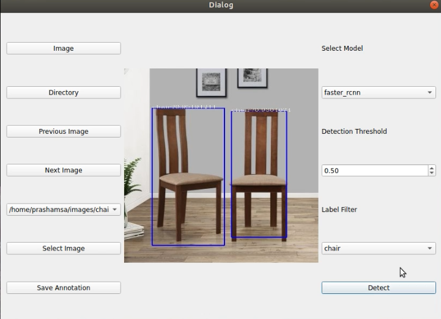

# Label Image 
It is a graphical image annotation tool.
Designed a python based auto labeling tool ,where in we can load a tensorflow model and images folder.Model runs
inference on images and draws bounding box and class label.

## How to use :
1. Clone this [repository](https://github.com/prashamsatalla/Label_Image.git).
2. Go to the directory where label.py exists.
3. Download Faster R-CNN, Mask R-CNN, ssdlite_mobilenet_v2 models from this [drive link](https://drive.google.com/drive/folders/1853yBqfrJuqaQfzxgH8HkIb-W3-qHlEu?usp=sharing).Unzip files and copy them in the directory.

###### Folder Structure:
  - Label_Image
    - faster_rcnn
    - Mask_RCNN
    - ssdlite_mobilenet_v2
    - label.py
    - label.txt
    - detection.py ( detailed code to get detected labels and co ordinates from model )

4. Run the python file.
```bash
python label.py
```
   
   
5. Then there appears UI. Select images folder by clicking 'Directory' and then once loaded click 'Select Image' to select desired image.
6. Select model and Detection threshold as required.
7. Also select object that you want the model to detect.
8. Click 'Detect' and Save annotations of detected objects.

## Defaults
- This tool confines to the models Faster R-CNN, Mask R-CNN, ssdlite_mobilenet_v2.

## Custom Application:
- Download tensorflow models from [here](https://github.com/tensorflow/models/blob/master/research/object_detection/g3doc/tf2_detection_zoo.md).
- List model names in model_list array in label.py.
- Make sure you create a label.txt where in object names of your Dataset are listed.

## Requirements 
- [tensorflow](https://www.tensorflow.org/install)
- [PyQt5](https://pypi.org/project/PyQt5/)
- [Opencv](https://pypi.org/project/opencv-python/)

## References
- [Tensorflow model zoo](https://github.com/tensorflow/models/blob/master/research/object_detection/g3doc/tf2_detection_zoo.md)
- [LabelImg Tool](https://github.com/tzutalin/labelImg)
